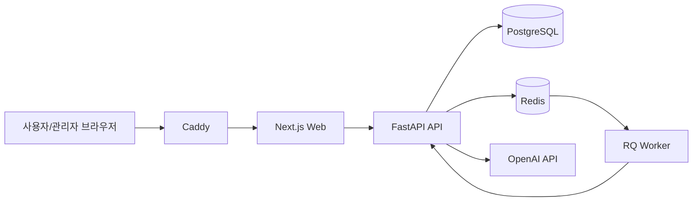

# SpartaExam Studio 시스템 아키텍처

## 서비스 개요
이 서비스는 관리자(튜터)가 시험을 만들고, 수강생이 응시한 뒤, 채점 결과를 공유하는 구조입니다.

핵심은 세 가지입니다.
- 시험 운영: 생성, 수정, 응시/제출, 시간 제한
- 채점 운영: 객관식 자동 판정 + 주관식/코딩 자동 평가 + 수동 보정
- 운영 안정성: 감사 로그, 배포 자동화, 백업/복구

## 기술 스택
- Frontend: `Next.js (App Router)`, `TypeScript`, `Tailwind CSS`
- Backend: `FastAPI`, `Pydantic`, `SQLAlchemy (async)`, `Alembic`
- Queue/Worker: `Redis`, `RQ`
- DB: `PostgreSQL`
- Reverse Proxy/TLS: `Caddy`
- 배포/CI: `Docker Compose`, `GitHub Actions`
- 자동 평가 연동: `OpenAI API`

## 아키텍처 다이어그램

## 도메인 모델
- 사용자/권한: `admin`, `user`
- 시험: 트랙, 상태, 시작 시각, 제한 시간, 결과 공유 여부
- 문항: 객관식/주관식/코딩 + 정답 기준
- 제출: 응시자 답안, 제출 시각, 제출 상태
- 채점: 점수, 피드백, 로그/근거
- 감사로그: 관리자 작업 이력

## 동작 흐름
### 시험 운영
1. 관리자가 시험과 문항을 생성한다.
2. 수강생이 시험에 들어오면 응시 시작 시각이 기록된다.
3. 남은 시간은 서버 기준이라 새로고침 후에도 이어진다.
4. 제출 확인 후 최종 제출된다.
5. 제출 완료 후에는 재응시할 수 없다.

### 채점/공유
1. 객관식은 정답 인덱스와 제출 인덱스를 비교해 판정한다.
2. 주관식/코딩은 정답 기준으로 자동 평가를 수행한다.
3. 필요하면 관리자가 수동 채점/재채점을 한다.
4. 결과는 관리자가 공개할 때 사용자 화면에 노출된다.

## 배포 구조
- 컨테이너: `web`, `api`, `worker`, `postgres`, `redis`, `caddy`
- 기본 배포: `main` 브랜치 반영 후 배포 스크립트 실행
- 배포 검증: 헬스체크 통과 기준

## 주요 경로
- 웹: `apps/web`
- API: `apps/api`
- 배포/운영 스크립트: `infra`, `scripts`, `.github/workflows`

