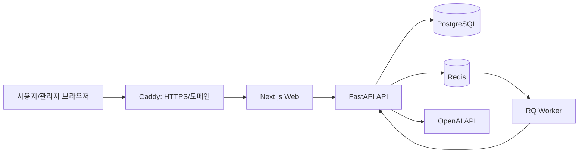

# QA 서비스 시스템 아키텍처

## 1) 시스템 개요
본 서비스는 **튜터(관리자)가 시험지를 만들고**, **수강생이 응시**하며, **자동/수동 채점 후 결과를 공유**하는 QA 평가 플랫폼입니다.

핵심 목표는 다음 3가지입니다.
- 시험 운영: 시험 생성, 문항/정답 관리, 시험 시간 제한, 응시/제출 관리
- 채점 운영: 객관식 정답 비교 + 주관식/코딩 LLM 평가 + 수동 재채점
- 운영 안정성: 감사 로그, 배포 자동화, 백업/복구 스크립트

## 2) 기술 스택
- Frontend: `Next.js (App Router)`, `TypeScript`, `Tailwind CSS`
- Backend API: `FastAPI`, `Pydantic`, `SQLAlchemy (async)`, `Alembic`
- Worker/Queue: `RQ`, `Redis`
- Database: `PostgreSQL`
- Reverse Proxy/TLS: `Caddy`
- Infra/Deploy: `Docker Compose`, `GitHub Actions`
- AI 채점: `OpenAI API` (설정 모델 기반)

## 3) 시스템 아키텍처

## 4) 주요 도메인 구성
- 사용자/권한: `admin`, `user`
- 시험: 시험 메타(트랙, 상태, 시험시간, 결과공유 여부)
- 문항: 객관식/주관식/코딩 + 정답
- 제출: 사용자 답안, 제출 시각, 상태
- 채점: 문항별 점수/피드백/근거
- 감사로그: 관리자 행위 이력(누가/언제/무엇을)

## 5) 핵심 동작 흐름
### 시험 생성/운영
1. 관리자가 시험지 생성(문항, 정답, 시험 시간)
2. 수강생이 시험 진입 시 응시 시작 시각 기록
3. 남은 시간은 서버 기준으로 계산되어 재접속/새로고침에도 유지
4. 제출 시 확인 모달 후 최종 제출
5. 제출 완료된 응시는 재응시 불가

### 채점/공유
1. 객관식: 정답 인덱스 비교
2. 주관식/코딩: 정답 기준 LLM 평가 + 피드백
3. 필요 시 관리자 수동 채점/재채점
4. 관리자가 결과 공유 버튼으로 사용자에게 공개

## 6) 배포 아키텍처
- 배포 단위: `web`, `api`, `worker`, `postgres`, `redis`, `caddy` 컨테이너
- 배포 방식: `main` 푸시 시 GitHub Actions가 운영 서버 SSH 접속 후 배포 스크립트 실행
- 실패 시: 헬스체크 실패 기준 자동 롤백 시도

## 7) 주요 기능 목록
- 인증: 로그인/회원가입/비밀번호 재설정
- 관리자: 시험지/문항/정답 관리, 리소스 업로드, 자동 채점 승인, 수동 채점, 사용자 관리, 감사 로그
- 수강생: 시험 응시, 타이머, 제출 확인, 내 제출 상세 확인, 결과 조회
- 운영: 백업/복구 스크립트, 배포 헬스체크, CI

## 8) 참고 경로
- 웹 앱: `apps/web`
- API 앱: `apps/api`
- 배포/인프라: `infra`, `scripts`, `.github/workflows`
