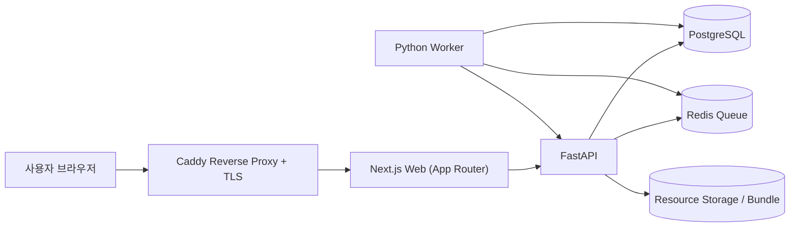

# QA 서비스 프로젝트 정리 (Notion 용)

## 1) 프로젝트 개요
- 프로젝트명: QA Lab
- 목적: 튜터(관리자)가 시험을 만들고, 수강생이 응시하며, 자동채점+수동검토+결과공유까지 처리하는 학습 평가 플랫폼
- 핵심 가치:
  - 시험 운영 자동화(출제/응시/채점/공유)
  - 대규모 수강생 운영 시 튜터 리소스 절감
  - 객관식/주관식/코딩 통합 평가

## 2) 해결하는 문제
- 수동 채점 시간 소모와 채점 편차
- 코딩/주관식 채점의 일관성 부족
- 결과 공개/재채점/이의제기 루틴 부재
- 운영 중 검토 필요 건 빠른 식별 어려움

## 3) 사용자와 권한
- 관리자(튜터)
  - 시험 생성/수정/삭제
  - 자동채점 시작(승인형)
  - 검토 필요 건 수동 확정
  - 결과 공유(학생별/시험 전체)
  - 사용자 관리, 감사 로그 확인
- 수강생
  - 시험 응시 및 제출
  - 내 제출/성취도 확인
  - 공유된 결과 열람

## 4) 현재 핵심 기능
- 시험 관리
  - 객관식/주관식/코딩 문항 혼합 시험 생성
  - 문항별 정답/정답기준 입력
  - 시험 시간 설정(제한/무제한)
- 응시 UX
  - 제출 전 확인 모달
  - 제출 후 재응시 방지
  - 제출 내역/정답 여부 확인
- 채점
  - 객관식: 정답 비교 즉시 채점
  - 주관식/코딩: LLM 기반 자동채점 + fallback
  - 애매 판정 자동 분리(`검토 필요`) 및 관리자 수동 확정
- 관리자 자동채점 관리
  - 시험/상태/학생 필터 및 검색
  - `대시보드 이동`으로 학생 제출 상세로 바로 이동
- 관리자 대시보드
  - 학생별 제출 상세
  - 문항별 정답/오답/검토 상태 확인
  - 수동 채점 및 사유 기록
- 수강생 성취도 대시보드
  - 객관식/주관식/코딩/전체 각각 `정답 수 / 전체 수`
  - 전체 문항별 정답 여부 표시
  - 강한 영역/보완 영역 키워드 제공
- 운영 기능
  - 감사 로그(관리자 행동 기록)
  - 검토 미완료 건 결과 공유 차단 정책

## 5) 채점 정책 요약
- 자동채점 최대화 + 애매 케이스만 인간 검토
- 판정 상태:
  - 정답(`correct`)
  - 오답(`incorrect`)
  - 미채점(`pending`)
  - 검토 필요(`review_pending`)
- 공유 정책:
  - `검토 필요`가 남아 있으면 결과 공유 차단
  - 수동 확정 후 공유 가능
- LLM 장애/쿼터 이슈:
  - fallback 채점으로 중단 없이 진행
  - 관리자 화면에서 검토 가능하도록 메타 유지

## 6) 시스템 아키텍처 (High-level)

## 7) 기술 스택
- Frontend: Next.js (App Router), TypeScript
- Backend: FastAPI, Python
- Queue/Async: Redis + Worker
- Database: PostgreSQL + Alembic Migration
- Infra: Docker Compose, Caddy(HTTPS), AWS EC2 운영
- CI/CD: GitHub Actions (CI + Production Deploy)

## 8) 주요 도메인 데이터
- 사용자: 계정, 역할, 트랙
- 시험: 제목/설명/상태/시간/대상 트랙
- 문항: 타입, 본문, 선택지, 정답/정답기준
- 제출: 시험별 사용자 제출
- 답안: 문항별 제출값 + 채점결과/피드백
- 리소스: 시험별 데이터/실습 파일
- 감사로그: 관리자 행동 이력

## 9) 주요 화면 구조
- 공용
  - 로그인/회원가입/비밀번호 재설정
- 관리자
  - 시험지 관리
  - 자동 채점 관리
  - 시험 대시보드(`/dashboard`)
  - 사용자 관리
  - 감사 로그
- 수강생
  - 시험 목록/응시
  - 내 제출 목록
  - 성취도 대시보드(`/dashboard`)

## 10) 운영/배포 구조
- 운영 도메인:
  - `https://spartaqa.com`
  - `https://qa.spartaqa.com`
- 배포 흐름:
  - `main` push
  - GitHub Actions CI 통과
  - Deploy Production 워크플로우로 서버 반영
- 컨테이너:
  - `web`, `api`, `worker`, `postgres`, `redis`, `caddy`

## 11) 품질 관리(현재 운영 방식)
- 정적/빌드 검증:
  - `pnpm --filter web lint`
  - `pnpm --filter web build`
  - `python -m compileall apps/api`
- 플로우 점검:
  - 자동채점 -> 검토필요 -> 수동확정 -> 결과공유 시나리오 테스트
- 테스트 데이터 원칙:
  - 검증용 시험/사용자 생성 후 즉시 삭제

## 12) 최근 반영 포인트 (요약)
- 자동채점 목록에서 학생 대시보드 바로 이동 버튼 추가
- 수강생 대시보드에 타입별/전체 정답 수 표시 강화
- 문항별 정답 여부 리스트 제공
- 강한 영역/보완 영역 키워드 제공
- 최근 코딩 제출 10건 섹션 제거

## 13) 운영 시 권장 KPI
- 자동채점 완료율
- 검토 필요 비율
- 수동 개입 소요시간
- 결과 공유 리드타임(제출~공유)
- 이의제기 비율 및 재채점 반전율

## 14) 향후 개선 제안
- 검토 필요 자동 우선순위(난이도/영향도 기준)
- 모델 평가셋 기반 채점 품질 회귀 테스트 자동화
- 리소스 보관 정책(예: 7일/30일 보관 후 정리) 고도화
- 운영 알림(공유 가능 상태, 실패율 상승 등) 자동화

---

## Notion 페이지 구성 추천
- `01. 프로젝트 개요`
- `02. 사용자/권한 정책`
- `03. 기능 명세(관리자/수강생)`
- `04. 채점 정책 & 운영 정책`
- `05. 시스템 아키텍처`
- `06. 배포/운영 가이드`
- `07. 테스트/검증 기록`
- `08. 개선 백로그`
