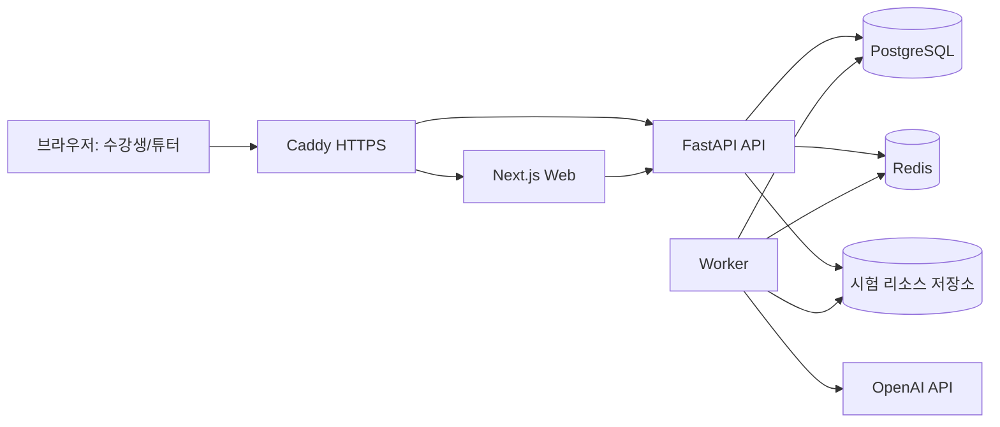

# QA 서비스 프로젝트 정리 (Notion용)

## 1) 프로젝트 개요
- 튜터(관리자)가 시험을 만들고, 수강생이 응시한 뒤, 자동/수동 채점과 결과 공유까지 한 번에 처리하는 시험 운영·평가 플랫폼입니다.

## 2) 해결하려는 문제

| 항목 | 기존 문제 | 해결 방향 |
|---|---|---|
| 시험 운영 | 생성/응시/채점/공유가 여러 도구로 분산 | 단일 서비스에서 end-to-end 처리 |
| 코딩/주관식 채점 | 튜터 수작업 부담 큼 | 자동채점 + 검토 필요 분리 |
| 결과 신뢰성 | 채점 근거/이력 추적 어려움 | 채점 사유 + 감사로그 + 재채점 루틴 |

## 3) 사용자
- 관리자(튜터): 시험 생성/수정, 채점 운영, 결과 공유, 사용자 관리
- 수강생: 시험 응시, 제출, 결과 확인, 성취도 확인

---

## 4) 기술 스택

| 레이어 | 기술 | 역할 |
|---|---|---|
| Frontend | Next.js(App Router), TypeScript | 관리자/수강생 UI, 라우팅, API 연동 |
| Backend | FastAPI, Python | 인증/시험/제출/채점 API |
| Async | Redis + Worker | 자동채점 비동기 처리 |
| DB | PostgreSQL + Alembic | 데이터 저장, 마이그레이션 |
| Infra | Docker Compose, Caddy, AWS EC2 | 컨테이너 운영, HTTPS, 배포 |
| CI/CD | GitHub Actions | CI 검증, 배포 파이프라인 |

---

## 5) 시스템 아키텍처 (High-level)



---

## 6) 기능 요약

### 6-1. 공통
- 로그인/회원가입/비밀번호 재설정
- 역할별 접근 제어(관리자/수강생)
- KST(Asia/Seoul) 시간 표기 통일

### 6-2. 관리자 기능
- 시험 생성/수정/재출제
- 시험명 중복 금지(동일 제목 저장 차단)
- 시험 시간 설정(분 단위, 무제한 옵션)
- 문항 유형: 객관식/주관식/코딩
- 코딩/주관식 정답·채점기준 대형 모달 입력
- 자동 채점 시작/강제 재채점
- 검토 필요(애매 판정) 필터 조회
- 학생별 제출 상세(학생 답/정답 기준/오답 이유)
- 수동 채점(정답 처리/오답 처리)
- 이의제기 문항 재채점
- 결과 공유(개별 학생/시험 전체)
- 사용자 관리(관리자끼리 삭제 방지)
- 감사 로그 확인

### 6-3. 수강생 기능
- 시험 목록 조회/응시
- 주관식/코딩 답안 대형 모달 작성
- 제출 확인 모달 후 최종 제출
- 제출 후 시험 목록 자동 이동
- 제출 완료/응답 보기 상태 반영
- 성취도 대시보드
  - 객관식/주관식/코딩/전체 정답 수
  - 문항별 결과(문항 번호, 유형, 정답 여부)
  - 강한 영역/보완 영역 키워드

---

## 7) 채점 정책

### 7-1. 객관식
- 정답 인덱스와 제출 인덱스 비교로 즉시 채점

### 7-2. 주관식/코딩
- LLM 기반 정답/오답 판정
- 한국어 오답 이유 제공
- LLM 실패(쿼터/네트워크 등) 시 fallback 채점으로 중단 없이 진행

### 7-3. 검토 필요(애매 판정)
- 경계 케이스를 `검토 필요`로 자동 분리
- 명백한 비코드 짧은 답안(예: `1`)은 불필요한 보류를 줄이도록 튜닝
- 정답과 유사도 높은 오답은 검토 필요 유지

### 7-4. 이의제기 재채점
- 해당 문항만 즉시 재채점
- 기본 자동채점 모델과 다른 모델로 재채점 가능

---

## 8) 관리자 가이드라인 (튜터 운영 매뉴얼)

## 8-1. 시작 전 체크리스트
- [ ] 관리자 계정 로그인
- [ ] 대상 트랙/반 확인
- [ ] 시험명 중복 여부 확인
- [ ] 시험 시간(제한/무제한) 설정 확인
- [ ] 객관식 정답 인덱스 검토
- [ ] 주관식/코딩 정답/채점 기준 입력 확인
- [ ] 필요한 리소스(데이터/실습 파일) 업로드

## 8-2. 시험 생성 표준 절차
1. 관리자 > 시험지 관리 > 새 시험 생성
2. 시험 기본 정보 입력
3. 문항 추가(객관식/주관식/코딩 혼합 가능)
4. 코딩/주관식은 "큰 화면 입력"으로 정답 기준 작성
5. 시험 생성 확인 모달에서 최종 생성
6. 시험 목록에서 공개 상태/초안 상태 확인

## 8-3. 채점 운영 절차
1. 자동 채점 관리에서 시험 선택
2. `자동 채점 시작` 실행
3. `검토 필요` 필터로 애매 케이스 우선 확인
4. 학생별 제출 상세에서 사유 확인 후 수동 확정
5. 필요 시 문항 단위 이의제기 재채점 실행
6. 최종 확정 후 결과 공유(개별/시험 전체)

## 8-4. 운영 중 주의사항
- 관리자 계정은 서로 삭제 불가(수강생만 삭제 가능)
- 시험 제목은 매 회차 고유하게 관리
- 결과 공유 전, 검토 필요 건이 남아있는지 확인
- 코딩 문항은 "정답 코드 + 핵심 체크포인트" 중심으로 작성

## 8-5. 장애/이슈 대응
- 자동채점 실패 시: fallback 여부와 사유 확인
- LLM 쿼터 이슈 시: 즉시 수동 확정 우선 처리
- 필터/표시 이상 시: 시험 선택값과 상태 필터 동기화 점검
- 운영 로그 필요 시: 감사 로그 페이지에서 사용자/행위/시각 확인

---

## 9) 수강생 가이드라인

## 9-1. 응시 전
- [ ] 계정 로그인
- [ ] 시험명/문항 수/시간 제한 확인
- [ ] 실습 리소스 파일 여부 확인

## 9-2. 응시 중
- 객관식: 보기 선택 후 다음 문항 이동
- 주관식/코딩: 큰 화면 답안 입력 사용 권장
- 시험 종료 전 전체 답안 재확인
- 제출 버튼 클릭 후 확인 모달에서 최종 제출

## 9-3. 제출 후
- 시험 목록으로 자동 이동
- 해당 시험은 `제출 완료 / 응답 보기` 상태로 전환
- 채점 완료 후 성취도 대시보드에서 결과 확인

## 9-4. 결과 해석
- 유형별 정답 수(객관식/주관식/코딩) 확인
- 문항별 정답 여부로 취약 문항 파악
- 강한 영역/보완 영역 키워드로 복습 우선순위 설정

---

## 10) 전체 서비스 사용 흐름 (모든 기능 포함)

```text
[관리자]
시험 설계 -> 문항 작성(정답/기준 입력) -> 시험 공개
-> (수강생 응시/제출)
-> 자동 채점 시작
-> 검토 필요/오답 사유 확인
-> 수동 확정 + 필요 시 이의제기 재채점
-> 결과 공유(개별/전체)

[수강생]
로그인 -> 시험 응시 -> 제출 확인 -> 최종 제출
-> 시험 목록 복귀(제출 완료 상태)
-> 채점 완료 후 성취도 대시보드 확인
-> 강점/약점 기반 복습
```

## 10-1. 상태 전이(요약)
- 시험: `draft -> published`
- 제출: `IN_PROGRESS -> SUBMITTED -> GRADED(또는 검토 필요)`
- 공유: `미공유 -> 개별 공유 또는 시험 전체 공유`

---

## 11) 운영 체크리스트 (릴리즈/수업 전)
- [ ] 웹 lint/build 통과
- [ ] API compileall 통과
- [ ] 자동채점/수동채점/공유 흐름 스모크 테스트
- [ ] 관리자/수강생 핵심 화면 점검
- [ ] 배포 URL 헬스체크(웹/API)

---

## 12) 향후 개선 아이디어
- 채점 임계값(검토 필요 기준) 관리자 설정화
- 검토 필요 건 일괄 확정 UX
- 트랙/코호트 비교 리포트
- 채점 품질 모니터링 대시보드
- 리소스 파일 보관 주기 자동 정리

