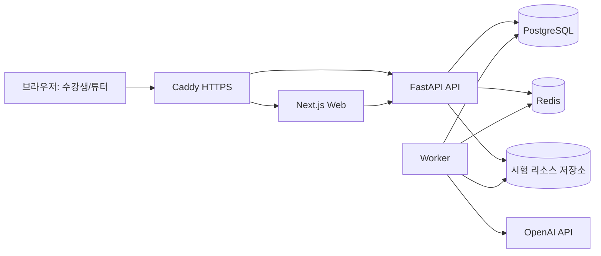

# QA 서비스 프로젝트 개요 (Notion 정리본)

## 1. 프로젝트 한 줄 소개
- 튜터(관리자)가 시험을 만들고, 수강생이 응시한 뒤, 자동/수동 채점과 결과 공유까지 한 번에 처리하는 시험 운영·평가 플랫폼

---

## 2. 문제 정의

| 항목 | 기존 문제 | 해결 방향 |
|---|---|---|
| 시험 운영 | 생성/응시/채점/공유가 분산 | 단일 서비스에서 end-to-end 처리 |
| 코딩·주관식 채점 | 튜터 수작업 부담 큼 | 자동채점 + 검토 필요 분리 |
| 결과 신뢰성 | 근거/이력 추적 어려움 | 채점 사유·감사로그·재채점 루틴 |

---

## 3. 사용자
- 관리자(튜터): 시험 생성/수정, 자동채점 운영, 수동 확정, 결과 공유
- 수강생: 시험 응시, 제출, 결과/성취도 확인

---

## 4. 핵심 가치
- 운영 효율: 반복 채점 업무 자동화
- 신뢰성: 검토 필요 분리 + 수동 확정 + 이의제기 재채점
- 실무성: 객관식/주관식/코딩 혼합 시험 운영

---

## 5. 주요 기능

### 5.1 인증/계정
- 로그인/회원가입/비밀번호 재설정
- 회원가입 입력 유효성 시각화(정상: 초록 체크, 오류: 빨간 X)
- 역할 기반 접근 제어(관리자/수강생)

### 5.2 관리자 기능
- 시험 생성/수정/재출제
- 시험명 중복 금지(서버 409 검증)
- 문항 유형: 객관식/주관식/코딩
- 주관식/코딩 정답·채점 기준 대형 모달 입력
- 시험 시간 설정(제한 시간/무제한)
- 자동 채점 시작, 강제 재채점
- 검토 필요(애매 판정) 필터 + 수동 확정
- 학생별 제출 상세(답안/정답 기준/오답 이유)
- 결과 공유(개별/시험 전체)
- 사용자 관리 및 감사 로그

### 5.3 수강생 기능
- 시험 목록 조회/입장
- 주관식/코딩 답안 대형 모달 작성
- 제출 확인 모달 + 최종 제출
- 제출 후 시험 목록 자동 이동
- 제출 완료/응답 보기 상태 반영
- 성취도 대시보드
  - 유형별 정답 수/총 문항 수
  - 문항별 결과(문항 번호/유형/정답 여부)
  - 강한 영역/보완 영역 키워드

---

## 6. 자동 채점 정책

### 6.1 객관식
- 정답 인덱스와 제출 인덱스 비교로 즉시 채점

### 6.2 주관식/코딩
- LLM 기반 판정
- 운영 정책: 정답/오답 중심 + 한국어 사유 제공
- LLM 실패 시 fallback 채점으로 중단 없이 진행

### 6.3 애매 판정(검토 필요)
- 경계 구간은 `검토 필요`로 분리
- 명백한 비코드 답안(예: `1`)은 보류 남발 방지 로직 적용
- 정답 유사도 높은 오답은 검토 대상으로 유지

### 6.4 이의제기 재채점
- 문항 단위 즉시 재채점
- 자동채점 모델과 별도 재채점 모델 정책 적용 가능

---

## 7. 시스템 아키텍처 (High-level)

---

## 8. 기술 스택

| 레이어 | 기술 | 역할 |
|---|---|---|
| Frontend | Next.js(App Router), TypeScript | 관리자/수강생 UI, 라우팅, API 연동 |
| Backend | FastAPI, Python | 인증/시험/제출/채점 API |
| Async | Redis + Worker | 자동채점 비동기 처리, 큐 소비 |
| DB | PostgreSQL + Alembic | 데이터 저장, 스키마 마이그레이션 |
| Infra | Docker Compose, Caddy, AWS EC2 | 컨테이너 운영, HTTPS, 서버 배포 |
| CI/CD | GitHub Actions | CI 검증, 배포 자동화(정책 기반) |

---

## 9. 운영 플로우 (실제 루틴)
1. 관리자 시험 생성
2. 수강생 응시/제출
3. 관리자 자동 채점 시작
4. 검토 필요 항목 필터링/수동 확정
5. 필요 시 이의제기 재채점
6. 관리자 최종 확정 후 결과 공유
7. 수강생 대시보드에서 결과 확인

---

## 10. 안정성/품질 체크
- 웹 lint/build 통과 후 반영
- API compileall 점검
- 배포 후 헬스체크(웹/API/도메인) 확인
- 자동채점 실패 시 fallback 정책으로 서비스 연속성 보장
- 주요 관리자 행위 감사로그 기록

---

## 11. 최근 주요 개선 사항
- 성취도 대시보드 문항 결과 간소화
- 코딩/주관식 입력 UX 모달화(관리자·수강생)
- 제출 후 목록 리다이렉트 및 상태 반영
- 시험명 중복 금지 서버 검증
- 이의제기 안내 문구 및 채점 안내 문구 정비
- 코딩 보류 오탐 개선(명백 오답은 보류 제외)

---

## 12. 향후 개선 우선순위

### 12.1 단기
- [ ] 채점 임계값(검토 필요 기준) 운영 설정화
- [ ] 검토 필요 건 일괄 처리 UX 개선
- [ ] 시험/트랙별 결과 공유 정책 템플릿화

### 12.2 중기
- [ ] LLM 채점 프롬프트 버전 관리 고도화
- [ ] 성취도 리포트(코호트/트랙 비교) 강화
- [ ] 대용량 리소스 보관/정리 자동화

### 12.3 장기
- [ ] 채점 품질 모니터링 대시보드
- [ ] 모델 A/B 테스트 기반 채점 안정화
- [ ] 운영 비용 최적화(큐/모델 호출 전략)

---

## 13. Notion에 바로 붙이는 팁
- 위 문서를 그대로 붙여넣으면 섹션/표/체크리스트 유지
- Mermaid 블록은 Notion의 코드블록으로 붙여넣어 다이어그램으로 변환
- 팀 운영 문서화 시 아래 하위 페이지 권장
  - `운영 매뉴얼`
  - `장애 대응`
  - `릴리즈 노트`
  - `채점 정책 변경 이력`
